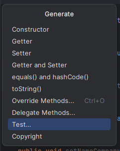
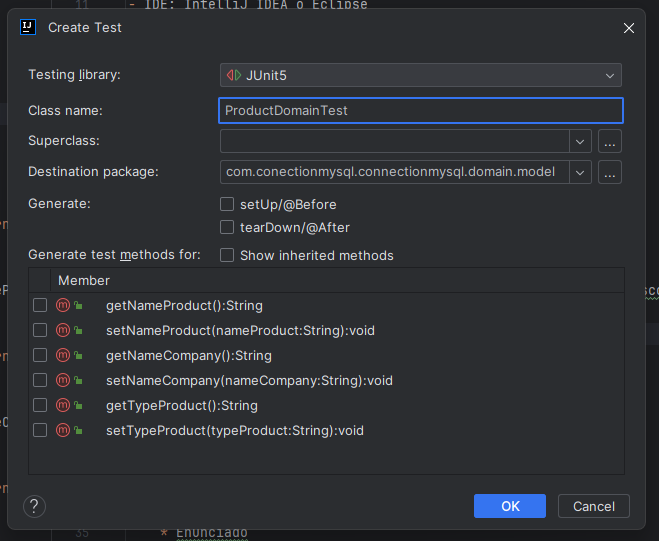
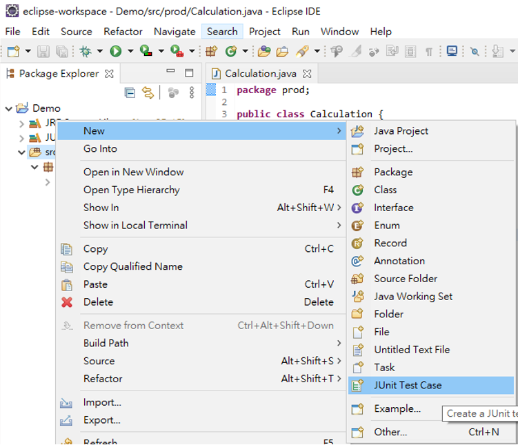
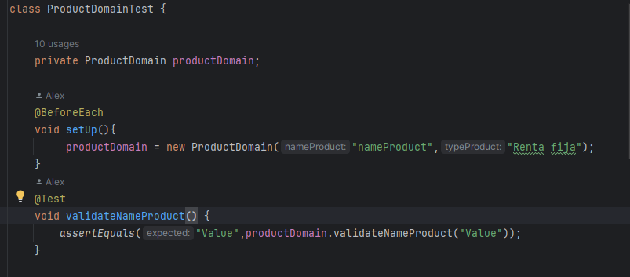

# Taller práctico de pruebas unitaras

## Consideraciones

> Tenga en cuenta que para poder desarrollar este taller 
> practico debe descargar el código que se encuentra en el repositorio
> Descargue aquí: [Ejercicio practico](https://github.com/AlexRodriguez09/taller-practico-pruebas-unitarias/archive/refs/heads/main.zip)

## Entorno

- IDE: IntelliJ IDEA o Eclipse
- JRE: OpenJDK 17

## Configuración

#### Paso 1
- Descargue el ejercicio práctico

#### Paso 2
- Importe el proyecto en eclipse o IntellIJ como proyecto maven
### Intellij

#### Paso 3
- Si está trabajando en IntellIJ siga estos pasos:

- Sobre la clase ProductDomain presione las teclas alt + insert, escoja la opción test  
  

- Asigne un nombre a la clase test y seleccione los métodos que desea probar  
  

- Una vez haya seleccionado los test y tenga un nombre para la clase seleccione ok.
### Eclipse

#### Paso 3
- Sobre la clase ProductDomain click derecho, seleccione new, JUnit Test Case  

- Asigne un nombre a la clase test y cree los métodos que desee probar

### Recomendaciones

- Para cada prueba unitaria o método que desee probar, añada la anotación @Test sobre el nombre del método.
  Esta anotación se importa de **import org.junit.jupiter.api.Test**  
- 

## Ejercicios prácticos

- [Ejercicio 1](#ejercicio-1)  

    * Asserts
    * Parametized
    * CsvSource
    * Enunciado
    * Pautas

- [Ejercicio 2](#ejercicio-2)
  * Mockito
  * Mock
  * When / Then
  * Verify
  * ArgumentCaptor
  * Enunciado

- [Ejercicio 3](#ejercicio-3)
  * Mock VS Spy

 
### Ejercicio 1

#### Asserts 

[¿Cómo usar asserts?](https://nuamexchange.atlassian.net/wiki/spaces/nuamArq/pages/62488670/JUnit5+Mockito#Assertions)

#### Paremetized 
[Parametized test](https://junit.org/junit5/docs/current/user-guide/#writing-tests-parameterized-tests)

#### CSV source
[Usando recursos](https://junit.org/junit5/docs/current/user-guide/#writing-tests-parameterized-tests-sources-CsvSource)

En la clase productDomain, cree las pruebas unitarias que considere necesarias para cumplir con los requerimientos de los atributos mencionados :  
Ruta de la clase **domain\model\ProductDomain.java**
* Nombre producto (nameProduct)
* Nombre empresa asociada (nameCompany)
* Tipo de producto (typeProduct)

Cada atributo debe cumplir con los siguientes requerimientos:  

- El **nombre** solo debe admitir valores alfanuméricos o alfabeticos.
- El **nombre empresa asociada** solo debe admitir valores alfabeticos
- El **tipo de producto** solo puede ser de **renta fija, renta variable o derivado**

> **Pautas para desarrollar el ejercicio**
> - Ya que conoce los requerimientos, use la metodología TDD para evaluar los casos:
>   - Diseñe una lista de casos de prueba o posibles escenarios para evaluar que el código de dominio cumple con su función.
>   - Escoja un escenario y escriba la prueba correspondiente (La prueba puede fallar).
>   - Escriba el código referente para que la prueba pueda pasar.
>   - Una vez pase la prueba unitaria, refactorice el código si es necesario y escoja el siguiente caso de prueba.
> - Use assertions para validar el resultado esperado y obtenido de una prueba unitaria.
> - Implemente la anotación @Parametirized usando @CSVSource para el atributo **nombre de empresa asociada** que permita evaluar diferentes escenarios.

### Ejercicio 2

#### Mockito
[Usando Mockito](https://nuamexchange.atlassian.net/wiki/spaces/nuamArq/pages/62488670/JUnit5+Mockito#Mockito)
#### Mock
[¿Qué es un Mock?](https://nuamexchange.atlassian.net/wiki/spaces/nuamArq/pages/62488670/JUnit5+Mockito#Mock-vs-Spy)
#### When / ThenReturn
[Usando When / Then](https://nuamexchange.atlassian.net/wiki/spaces/nuamArq/pages/62488670/JUnit5+Mockito#When-/-Then)
#### doNothing / When
[Uso de doNothing](https://nuamexchange.atlassian.net/wiki/spaces/nuamArq/pages/62488670/JUnit5+Mockito#doNothing-/-When)
#### Verify
[Usando verify](https://nuamexchange.atlassian.net/wiki/spaces/nuamArq/pages/62488670/JUnit5+Mockito#Verify)

#### ArgumentCaptor y captor
[Usando ArgumentCaptor](https://nuamexchange.atlassian.net/wiki/spaces/nuamArq/pages/62488670/JUnit5+Mockito#Captor)

Lea la documentación mencionada a continuación y realice los siguientes ejercicios:  

- **A**. Cree un test unitario para la clase **ProductPortImpl** para los métodos guardar y eliminar que son de tipo void
  - Ruta de la clase **application\service\ProductPortImpl.java**
1. Los métodos deben usar la dependencia IProductPersistence con los respectivos métodos createProduct y updateProduct.
2. En la clase de prueba y añada la anotación @EntendWith(MockitoExtension.class)
3. Cree un mock para la interfaz IProductPersistence - (use la anotación @Mock)
4. nyecte los mocks para ProductPortImpl - (use la anotación @InyectMocks)
5. Use doNothing para configurar el entorno de la prueba para los métodos createProduct y updateProduct de la dependencia IProductPersistence 
5. Llame el método createProduct de la clase que está probando
6. Con verify de **import static org.mockito.Mockito.***, valide que los métodos usados en la prueba unitaria están siendo llamados

- **B**. Cree un test unitario para la clase **ProductPersistenceImpl** para los métodos de consulta: getProductID y getProducts
  - Ruta de la clase **infraestructure\adapters\output\ProductPersistenceImpl.java** 
1. Genere el retorno de las consultas correspondientes usando la interfaz IProductRepository.finById o findAll.
2. En la clase de prueba, cree un mock para la interfaz IProductRepository - (use la anotación @Mock)
3. Inyecte los mocks para ProductPersistenceImpl - (use la anotación @InyectMocks)
4. Configure la prueba con los métodos when / thenReturn
5. Llame el método que desea probar, ejemplo: productPersistenceImpl.getProductID guarde el resultado en una variable
6. Valide que el resultado esperado es igual al resultado obtenido. 
  

Usar las anotaciones de:

- @ExtendWith(MockitoExtension.class)
- @InjectMocks
- @Mock
- @Argumentcaptor
- @Captor
- @DoNothing

### Ejercicio 3

Revisar un ejemplo práctico entre las diferencias entre un Mock y un Spy, usando productDomain

>Desarollo un ejemplo práctico donde utilice un Spy, dado el ejemplo presentado en el Ejercicio 3